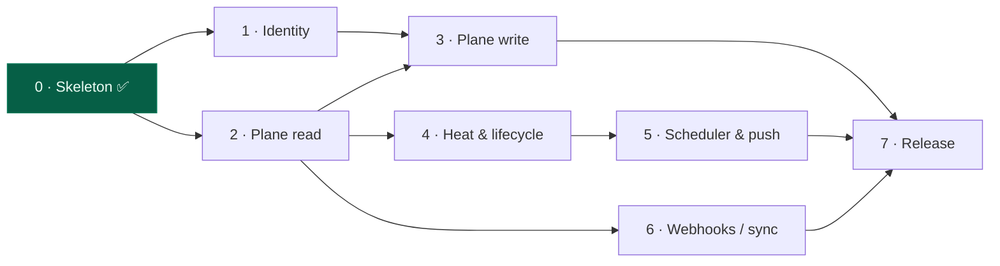

# Bubble Work — Implementation Plan (Logbook)

> This is the living Logbook (§3.2) for the thread **"Build the Bubble Work server & clients."**
> It decomposes the build into phases; each phase has a Definition of Done.
> Update the status column and check boxes as reality changes — nothing here is heat until it ships.

**Status legend:** ✅ done · 🔄 in progress · ⬜ not started · 🚫 blocked

## Progress at a glance

| # | Phase | Outcome | Status |
|---|-------|---------|--------|
| 0 | Skeleton & spine | One binary boots; REST + MCP + policy gate live | ✅ |
| 1 | Identity & membership | Clients authenticate as team members; writes attributed | ✅ |
| 1.5 | Federation (multi-instance) | Server federates N Plane instances; members scoped per instance | ✅ |
| 1.6 | Plane-native identity | Humans auth via Plane pass-through; role + scope derived from Plane | ✅ |
| 2 | Plane read path | `bubble ls` shows real bubbles with correct heat (per instance) | ✅ |
| 3 | Plane write path | Birth & contracts flow into Plane | ✅ |
| 4 | Heat & lifecycle hardening | Tested, explainable temperature rules | ⬜ |
| 5 | Scheduler & inbox | Cooling/dormant transitions land in a per-person inbox, unattended | ✅ |
| 6 | Sync robustness & webhooks | Real-time updates; conflict policy enforced | 🔄 |
| 7 | Packaging, deploy & CI | Deployed on the platform; push-to-main auto-deploys | 🔄 |

## Phase dependencies

---

## Phase 0 — Skeleton & spine ✅

**Goal:** a single binary that boots and proves the architecture (Model A, two front doors, unbypassable policy).

- [x] One Go binary, subcommands `serve | ls | heat | init | version`
- [x] SQLite overlay store (pure-Go `modernc`, single static binary)
- [x] `heat.Classify()` — pure temperature function (§0/§5)
- [x] Plane REST client (read stubs) — the sole path to Plane
- [x] Server: REST `/api` + our own MCP `/mcp`, tools registered
- [x] Policy gate: `birth_thread` rejects missing Brief / Definition of Done / Logbook
- [x] `AGENTS.md` + `CLAUDE.md` so the repo runs on its own framework
- [x] Build, `go vet`, boot, and endpoint smoke-tests pass

**Definition of Done:** `go build ./...` clean; `bubble serve` boots; REST, MCP handshake, and the birth-rule reject/accept paths verified. ✅ **Met.**

---

## Phase 1 — Identity & membership ✅

**Goal:** turn a client into an actual team member (§9.3). Every request resolves to a Member; every write is attributed.

- [x] `members` table CRUD in `store` (`CreateMember` / `ListMembers` / `RevokeMember` / `MemberByToken`)
- [x] `bubble member add --name --kind human|agent [--plane-id]` → issues a token (local DB, bootstraps the first token)
- [x] Auth middleware on REST (`restAuth`) + MCP (SDK `auth.RequireBearerToken`): reject unauthenticated; put the Member in `context`
- [x] Thread the actor through `BirthThread` / `CloseBubble` for attribution (logged, both front doors)
- [x] Capture Member → Plane identity (`plane_id` stored & carried; *used* for assignee/comment in Phase 3)
- [x] Client sends its `token` on every call; friendly 401 guidance
- [x] Tests: unauthenticated → 401, bad token → 401, valid → 200; birth policy reject/accept

**Dependencies:** Phase 0.
**Definition of Done:** no state-changing call succeeds without a valid member token; each request logs *which member* acted; `bubble ls` works when authenticated and is refused when not. ✅ **Met** — verified via `go test ./...` and an end-to-end REST + MCP smoke test.

---

## Phase 1.5 — Federation (multiple Plane instances) ✅

**Goal:** the server federates over several Plane deployments; members are scoped to the instances they may see (isolation between orgs).

- [x] `plane_instances` + `member_instances` tables; instance CRUD + grant/revoke in `store`
- [x] `bubble instance add|list|remove` (API keys stored server-side, never printed)
- [x] `bubble member grant|deny <member-id> <instance-slug>` with existence validation
- [x] `collect()` fans out over the caller's authorized instances; bad instance logged + skipped
- [x] Instance pins one project, or federates the whole workspace when `--project` is omitted (auto-discovers all projects)
- [x] Bubble ids namespaced `<instance-slug>:<project-id>:<module-id>`; `bubble ls` shows an INSTANCE column
- [x] Plane creds removed from `config.json` (moved into the store)
- [x] Store test: a member sees only granted instances; revoke removes visibility

**Definition of Done:** two instances registered; two members each see only their granted instance's bubbles; a query never touches an unauthorized instance. ✅ **Met** — verified via store test + an end-to-end isolation smoke test.

---

## Phase 1.6 — Plane-native identity (pass-through) ✅

**Goal:** stop duplicating Plane's identity (§8). Humans authenticate with their own Plane API key; agents keep server tokens.

- [x] `plane.Client.Me()` (`/users/me`) and `Members()` (`/members/`, roles 20/15/5)
- [x] Request identity unified as `domain.Actor` (id, name, kind, email, admin, instances)
- [x] `resolve()` — agent token → local member+grants; else Plane key → `/users/me` + cross-instance email match for scope + role, cached (TTL)
- [x] REST middleware + MCP verifier both resolve to an `Actor`; attribution updated
- [x] Admin derived from Plane role ≥ 20; `close_bubble` refuses instances you can't see
- [x] `bubble whoami` + `GET /api/whoami` to confirm the resolved identity
- [x] `bubble member add` reframed as agent-only; human `member add`/grants no longer needed
- [x] Tests: Plane pass-through (identity + admin + scope from a fake Plane); agent path

**Definition of Done:** a human runs `bubble init --token <their-plane-key>` and `bubble whoami` shows their name, admin role, and every instance they belong to — with no member created or grant issued. ✅ **Met** — verified via the pass-through test and a live smoke test.

> Note: this supersedes Phase 1's member registry **entirely**. Agents impersonate
> a human by using that human's Plane key (direct-key impersonation), so there is
> no local member / token / grant machinery — auth is pass-through only. The
> `members` and `member_instances` tables and the `bubble member` command were
> removed; the isolation boundary is now Plane workspace membership itself.

---

## Phase 2 — Plane read path (real buoyancy) ✅

**Goal:** `bubble ls` reflects each live Plane instance with correct temperatures — fast.

- [x] Cursor pagination (`per_page` + `next_cursor`/`next_page_results`) in `plane.Client` list calls
- [x] Concurrent fan-out across projects/modules (`errgroup`, bounded); one bad module/instance logged + skipped
- [x] Per-instance bubble cache (TTL) so repeated `ls` is instant; client timeout raised to 60s
- [x] **Heat without the N×M×K activity explosion:** evidence derived from work-item `created_at` (thread born) + `completed_at` (todo done) in the list response — no per-item activity call
- [x] Tests: heat classifier (all lifecycle branches + score decay); fetch/pagination via fake Plane
- [x] Verified JSON shapes against a **live** Plane project — `bubble ls` on cuby surfaced and fixed `state` (a UUID string on module-issues, not the expanded object)
- [x] Instance connectivity check — `bubble instance add` verifies via `/users/me` + workspace/project resolve before storing (`--no-verify` bypasses)

**Dependencies:** Phase 1.5.
**Definition of Done:** against your real `ayetec`/`cuby`, `bubble ls` returns quickly and lists modules as bubbles, hottest-first, tagged by instance. ✅ **Met** — live `bubble ls` on cuby returned the two seeded bubbles (🔥 Hot) plus all real modules (🧊 Dormant, no owner) in well under the timeout.

> Design note: heat now comes from work-item timestamps, not the activities endpoint. This trades some fidelity (a completed/created todo counts as evidence; comments don't surface) for staying within Plane's rate limits and sub-second `ls`. A precise activity-based breakdown can enrich `bubble heat <id>` later.

---

## Phase 3 — Plane write path (birth & contracts flow to Plane)

**Goal:** the framework writes back — births create work items; contracts and closures persist.

- [x] `bubble bubble set --outcome --owner --closure` → server API → `store.SetContract` (§4), instance-scoped
- [x] `bubble bubble close|open` (reopen) via the server; `set_contract` MCP tool for parity
- [x] Short/prefix bubble ids: `ls` shows the module id; heat/set/close/open resolve exact-or-unique-prefix (git-style), ambiguous→400, unknown→404
- [x] Writes patch the cached bubble in place (no Plane refetch) — instant reflection, avoids rate-limit storms
- [x] Tests: contract set reflected in `ls`, close→Closed, reopen, `matchBubble` resolution; **live e2e green against cuby** (whoami/ls/heat/set/close/reopen)
- [x] `plane.Client` write methods: `CreateWorkItem`, `DefaultState`, `AddIssuesToModule` (POST helper)
- [x] `BirthThread` POSTs the work item with **Brief + Logbook in `description_html`** (§7.1), links it to the module, patches the cache
- [x] `bubble birth <id> --name --brief[-file] --logbook[-file] [--small]` CLI + `birth_thread` MCP
- [x] **Impersonation writes:** the work item is created with the caller's own Plane key (threaded via request context, never serialized), so Plane attributes it to them
- [x] Tests: birth creates a work item + reflects on the bubble (fake Plane); **live-validated on cuby** (real work item created, attributed to the caller)
- [ ] `close_bubble` optionally reflects closure into Plane (label/state), not just overlay — *deferred*

**Dependencies:** Phase 1 (attribution), Phase 2 (read shapes).
**Definition of Done:** birthing a thread through CLI or MCP creates a real Plane work item carrying its Brief + Logbook; setting/closing a bubble's contract survives a server restart.

---

## Phase 4 — Heat & lifecycle hardening

**Goal:** the temperature rules are precise, tested, and explainable.

- [ ] Finalize the cycle model (configurable pulse; document current vs previous windows)
- [ ] Confirm transition rules Hot→Warm→Cooling→Dormant→Closed against §5.3 edge cases
- [ ] `bubble heat` shows the contributing evidence events + which cycle each fell in
- [ ] Table-driven tests for `Classify()` across every lifecycle branch
- [ ] Document the buoyancy `Score` formula in the spec

**Dependencies:** Phase 2.
**Definition of Done:** every lifecycle branch has a passing test; `bubble heat` explains *why* with the evidence that produced the verdict.

---

## Phase 5 — Scheduler & inbox ✅

**Goal:** time-driven side effects happen with nobody at the keyboard, and what's sinking is surfaced to members (§6 of the earlier brainstorm).

**Scheduler + detection:**
- [x] `Tick` recomputes all bubbles (server-wide) and detects downward transitions
- [x] Dormant notice recommends "revive or close" (§8); first sighting baselined silently (no flood)
- [x] In-process ticker inside `serve` (interval from `tick_minutes`, default 60; 0 disables); `bubble tick` / `POST /api/tick` on demand

**Server-side inbox (the chosen delivery model — a queue members consume, not external push):**
- [x] Notification queue in SQLite, scoped per instance
- [x] Per-person **read receipts keyed by email** (stable across instances), unread flag + count; one person's reads don't affect another's
- [x] **Opt-in** preference per person (`member_prefs`, default off); inbox hidden until enabled
- [x] API: `GET /api/notifications` (inbox: enabled + unread_count + items), `POST /api/notifications/read` (ids|all), `POST /api/notifications/prefs`
- [x] CLI: `bubble notifications` (list), `… on|off`, `… read <id|all>`
- [x] Tests: `coolingNotice` matrix; full `Tick` integration; store read-receipts/unread/scoping/prefs

**Dependencies:** Phase 4.
**Definition of Done:** a bubble that goes quiet is recorded in a per-person inbox with read state and surfaced to opted-in members (CLI now, web UI later). ✅ **Met.**

> Interruptive push (desktop/webhook) is intentionally **not** built — the design is a pull inbox (like GitHub), with a future web UI rendering unread badges. Keeping `serve` running unattended (`launchd`) is Phase 7 ops.

---

## Phase 6 — Sync robustness & webhooks 🔄

**Goal:** real-time reaction when the server is publicly reachable; polling remains the fallback.

- [x] `POST /webhooks/plane/{slug}` endpoint, per-instance, **HMAC-SHA256 verified** (`X-Plane-Signature`) → drops that instance's cache so `ls` is fresh on next read
- [x] Webhook secret stored per instance (`webhook_secret` col + migration); `bubble instance webhook <slug> --secret`
- [x] Polling is the fallback (unchanged) — webhooks only accelerate freshness
- [x] Tests: valid signature → 200 + cache dropped; bad signature → 403; unknown instance → 404
- [ ] Deploy publicly (Cloudflare tunnel → host) + register the Plane webhooks — *ops, in progress*
- [ ] Conflict policy note per §9.2 (Plane wins its fields; server wins the overlay) — already true by construction

**Dependencies:** Phase 2.
**Definition of Done:** a change made directly in Plane's UI appears in `bubble ls` within seconds via webhook, with polling as the proven fallback. ⏳ **Code done; awaiting public deploy + webhook registration.**

---

## Phase 7 — Packaging, deploy & CI 🔄

**Goal:** deployed, reproducible, and one-`git push` to ship.

**Done — deployed on the reko services platform:**
- [x] Mounted as `angel-bubble-work` under pm2 (`:3104`, `BUBBLE_HOME`, built from source); survives reboots via the pm2 LaunchAgent
- [x] `/health` endpoint + `PORT` env (platform conventions)
- [x] Public hostname + wildcard TLS via NPM (`https://bubble.angel.cubytest.space`)
- [x] **Auto-deploy CI:** self-hosted runner on the mini + `.github/workflows/deploy.yml` → `deploy-service` on push to `main` (docs-only pushes skipped). Verified: `/health` revision tracks HEAD.
- [x] `DEPLOY.md` documents the whole mount; `README.md` quickstart exists
- [x] Static binary story (pure-Go/CGO-free) — builds from source on the target

**Deferred / optional:**
- [ ] `claude mcp add … /mcp` doc for connecting an agent
- [ ] `CHANGELOG` / tagged releases (build-from-source makes goreleaser optional)

**Dependencies:** Phases 3, 5, 6.
**Definition of Done:** a change pushed to `main` auto-deploys to the live server, which is reachable at a documented URL. ✅ **Met.**

---

## Cross-cutting (every phase)

- [ ] Unit tests alongside each package; `go test ./...` green
- [ ] CI: build + vet + test on push
- [ ] Structured logging with the acting member (from Phase 1) on every mutation
- [ ] Keep `bubble-work-spec.md` authoritative — code changes that alter behavior update the spec

---

*Heat rule for this plan: a checked box is only heat when it maps to a committed/verified change (§5.1). Checking a box you haven't shipped is exactly the "activity gaming" the framework is designed to prevent.*
