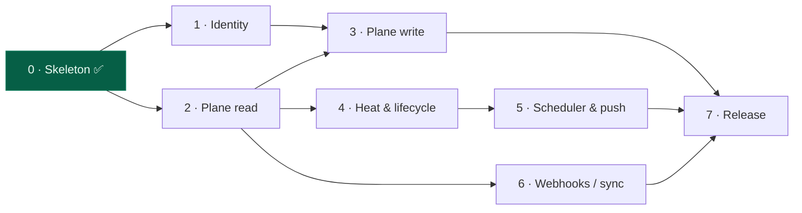

# Bubble Work — Implementation Plan (Logbook)

> This is the living Logbook (§3.2) for the thread **"Build the Bubble Work server & clients."**
> It decomposes the build into phases; each phase has a Definition of Done.
> Update the status column and check boxes as reality changes — nothing here is heat until it ships.

**Status legend:** ✅ done · 🔄 in progress · ⬜ not started · 🚫 blocked

## Progress at a glance

| # | Phase | Outcome | Status |
|---|-------|---------|--------|
| 0 | Skeleton & spine | One binary boots; REST + MCP + policy gate live | ✅ |
| 1 | Identity & membership | Clients authenticate as team members; writes attributed | ⬜ |
| 2 | Plane read path | `bubble ls` shows real bubbles with correct heat | ⬜ |
| 3 | Plane write path | Birth & contracts flow into Plane | ⬜ |
| 4 | Heat & lifecycle hardening | Tested, explainable temperature rules | ⬜ |
| 5 | Scheduler & push | Cooling/dormant transitions notify with nobody at the keyboard | ⬜ |
| 6 | Sync robustness & webhooks | Real-time updates; conflict policy enforced | ⬜ |
| 7 | Packaging & release | One-command install / documented deploy | ⬜ |

## Phase dependencies

---

## Phase 0 — Skeleton & spine ✅

**Goal:** a single binary that boots and proves the architecture (Model A, two front doors, unbypassable policy).

- [x] One Go binary, subcommands `serve | ls | heat | init | version`
- [x] SQLite overlay store (pure-Go `modernc`, single static binary)
- [x] `heat.Classify()` — pure temperature function (§0/§5)
- [x] Plane REST client (read stubs) — the sole path to Plane
- [x] Server: REST `/api` + our own MCP `/mcp`, tools registered
- [x] Policy gate: `birth_thread` rejects missing Brief / Definition of Done / Logbook
- [x] `AGENTS.md` + `CLAUDE.md` so the repo runs on its own framework
- [x] Build, `go vet`, boot, and endpoint smoke-tests pass

**Definition of Done:** `go build ./...` clean; `bubble serve` boots; REST, MCP handshake, and the birth-rule reject/accept paths verified. ✅ **Met.**

---

## Phase 1 — Identity & membership

**Goal:** turn a client into an actual team member (§9.3). Every request resolves to a Member; every write is attributed.

- [ ] `members` table CRUD in `store` (create/list/revoke); `MemberByToken` already exists
- [ ] `bubble member add --name --kind human|agent [--plane-id]` → issues a token
- [ ] Auth middleware on REST + MCP: reject unauthenticated; put the Member in `context`
- [ ] Thread the actor through `BirthThread` / `CloseBubble` for attribution
- [ ] Map Member → Plane identity (for assignee / comment author later)
- [ ] Client sends its `token` (config) on every call
- [ ] Tests: unauthenticated → 401; valid token → resolves Member

**Dependencies:** Phase 0.
**Definition of Done:** no state-changing call succeeds without a valid member token; each request logs *which member* acted; `bubble ls` works when authenticated and is refused when not.

---

## Phase 2 — Plane read path (real buoyancy)

**Goal:** `bubble ls` reflects a live Plane workspace with correct temperatures.

- [ ] Verify JSON shapes against a live Plane project (modules, `module-issues`, activities)
- [ ] Handle cursor pagination (`?cursor=…`) in `plane.Client` list calls
- [ ] Harden `Meaningful()` against real activity `field`/`verb` values (§5.1 allowlist)
- [ ] `bubble init` connectivity check (ping Plane, report workspace/project resolved)
- [ ] Read-model cache table + refresh, so `ls` is fast and rate-limit friendly
- [ ] Tests: `Meaningful()` mapping; heat over a fixture activity set

**Dependencies:** Phase 0.
**Definition of Done:** against a real workspace, `bubble ls` lists modules as bubbles, hottest-first, and `bubble heat <id>` explains the state from actual activity — no manual data.

---

## Phase 3 — Plane write path (birth & contracts flow to Plane)

**Goal:** the framework writes back — births create work items; contracts and closures persist.

- [ ] `plane.Client` write methods: create work item, set description/page, link to module
- [ ] `BirthThread` POSTs the work item with **Brief + Logbook in one description page** (§7.1)
- [ ] `bubble bubble new|set --outcome --owner --closure` → `store.SetContract` (§4)
- [ ] `close_bubble` optionally reflects closure into Plane (label/state), not just overlay
- [ ] Idempotency / error surfacing on partial Plane failures
- [ ] Tests: birth creates a work item (against a scratch project or mocked transport)

**Dependencies:** Phase 1 (attribution), Phase 2 (read shapes).
**Definition of Done:** birthing a thread through CLI or MCP creates a real Plane work item carrying its Brief + Logbook; setting/closing a bubble's contract survives a server restart.

---

## Phase 4 — Heat & lifecycle hardening

**Goal:** the temperature rules are precise, tested, and explainable.

- [ ] Finalize the cycle model (configurable pulse; document current vs previous windows)
- [ ] Confirm transition rules Hot→Warm→Cooling→Dormant→Closed against §5.3 edge cases
- [ ] `bubble heat` shows the contributing evidence events + which cycle each fell in
- [ ] Table-driven tests for `Classify()` across every lifecycle branch
- [ ] Document the buoyancy `Score` formula in the spec

**Dependencies:** Phase 2.
**Definition of Done:** every lifecycle branch has a passing test; `bubble heat` explains *why* with the evidence that produced the verdict.

---

## Phase 5 — Scheduler & push

**Goal:** time-driven side effects happen with nobody at the keyboard (§6 of the earlier brainstorm).

- [ ] `bubble tick` one-shot: recompute, detect cooling/dormant transitions
- [ ] Notification sink(s): stderr/log first, then webhook or CLI digest
- [ ] "Recommend closing" output for zombie bubbles (§8)
- [ ] Optional in-process ticker inside `serve` (interval configurable)
- [ ] Doc: sample `launchd`/cron/systemd-timer entry to run `bubble tick`
- [ ] Tests: a bubble crossing into Dormant emits exactly one notification

**Dependencies:** Phase 4.
**Definition of Done:** a bubble that goes quiet past its threshold produces a notification on a scheduled `tick`, and never manufactures heat to stay warm.

---

## Phase 6 — Sync robustness & webhooks (optional)

**Goal:** real-time reaction and a clean conflict policy; only if polling proves insufficient.

- [ ] `POST /webhooks/plane` endpoint to ingest Plane events → invalidate/refresh cache
- [ ] Conflict policy per §9.2 (Plane wins its fields; server wins the overlay)
- [ ] Rate-limit / backoff around Plane calls
- [ ] Fallback to polling when webhooks are unavailable

**Dependencies:** Phase 2.
**Definition of Done:** a change made directly in Plane's UI appears in `bubble ls` within seconds via webhook, with polling as a proven fallback.

---

## Phase 7 — Packaging & release

**Goal:** minimal, easy to publish (the original ask).

- [ ] `README.md` quickstart (serve, init, connect an agent)
- [ ] `claude mcp add --transport http bubble http://<host>/mcp` documented
- [ ] Cross-compiled static binaries (goreleaser) — no cgo, single file
- [ ] Optional: `Dockerfile` + a one-line deploy (fly.io / container)
- [ ] Secrets handling: env + config file; optional OS keyring for the member token
- [ ] Versioning + `CHANGELOG`

**Dependencies:** Phases 3, 5, 6.
**Definition of Done:** a new user can install the binary, `bubble init`, `bubble serve`, connect Claude Code as a member, and see bubbles — from documented steps alone.

---

## Cross-cutting (every phase)

- [ ] Unit tests alongside each package; `go test ./...` green
- [ ] CI: build + vet + test on push
- [ ] Structured logging with the acting member (from Phase 1) on every mutation
- [ ] Keep `bubble-work-spec.md` authoritative — code changes that alter behavior update the spec

---

*Heat rule for this plan: a checked box is only heat when it maps to a committed/verified change (§5.1). Checking a box you haven't shipped is exactly the "activity gaming" the framework is designed to prevent.*
