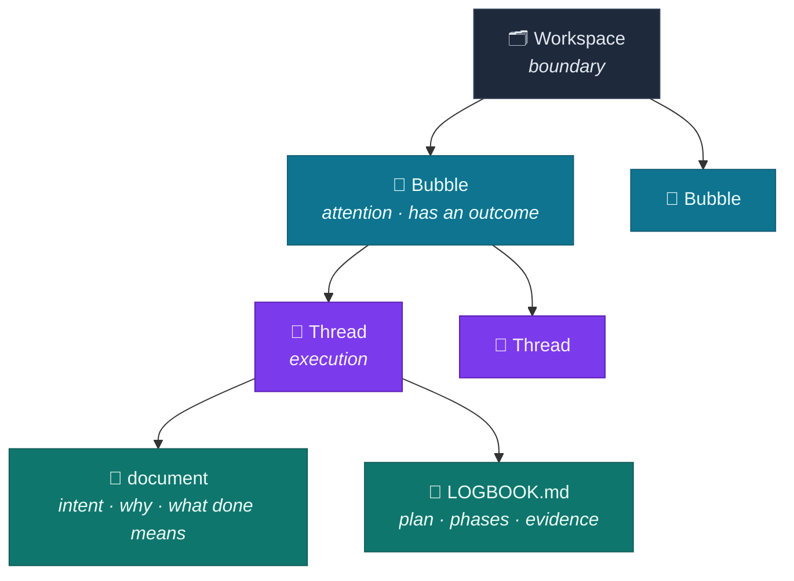
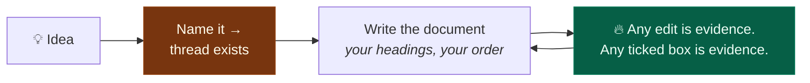
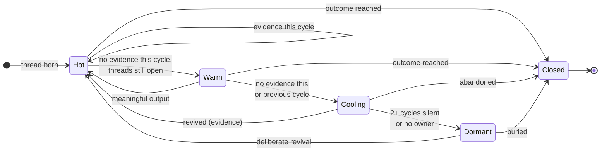
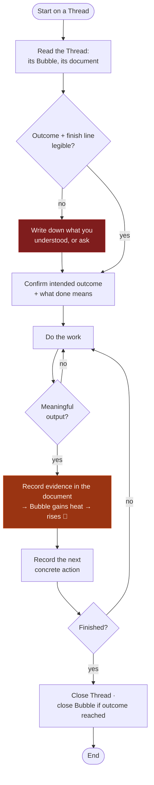

# Bubble Work

> A personal way-of-working where **attention behaves like buoyancy**.
> Work that produces evidence stays *hot* and *rises*; work that goes quiet *cools* and *sinks*.
> Time is the governing force. Your only standing job is to tend what floats at the top.

**One-line model:**
`Workspace = boundary · Bubble = attention · Cycle = pulse · Thread = execution · Artifacts = evidence`

This README is the **way of thinking** — the model, and nothing about how it is
built. The rules agents load are [`AGENTS.md`](./AGENTS.md); what is being built
and why is [`PLAN.md`](./PLAN.md).

> **The implementation is archived.** v0 — in which Plane held the record — is at
> the tag `v0-plane-as-record`. This model is what survived it and is unchanged.
> §7.2 below describes v0's division of ownership and is now history:
> [`PLAN.md`](./PLAN.md) supersedes it, and Bubble owns the record.

---

## 0. The central metaphor: heat *is* buoyancy

Bubbles rise and sink. The physics that makes that literal is **temperature**:
hot air rises, cold air sinks. So there aren't two metaphors — there is one.

| State | Temperature | Buoyancy | What it means |
|-------|-------------|----------|---------------|
| Fresh, producing evidence now | **Hot** | Rises to top | Work in progress, on your radar |
| Recent evidence, threads still open | **Warm** | Floats | Alive but slowing |
| No evidence this pulse or last | **Cooling** | Sinking | Being deferred |
| Silent for 2+ pulses / no owner | **Dormant** | At the bottom | Needs revival or burial |
| Outcome reached or abandoned | **Closed** | Removed | Done — stops taking attention |

A bubble rises **only** when reality changes (evidence), and sinks
**automatically** as time passes without it. You never manually "keep something
warm" — you either produce evidence or you let it sink honestly.

---

## 1. Vocabulary (and collision warnings)

The metaphor lives in the **human-facing layer**. Every term below has an
explicit meaning so it never collides with tool terms or engineering terms.

| Term | Meaning in Bubble Work | ⚠️ Do not confuse with |
|------|------------------------|------------------------|
| **Workspace** | The boundary for a body of work (a project, or a temporal frame like a week/quarter) | A vendor "Workspace" (e.g. Plane's org-level container) |
| **Bubble** | A durable grouping of related threads — a unit of *attention* | A folder — a bubble has an outcome and can die |
| **Thread** | One executable unit of work inside a bubble | OS/CPU threads |
| **Cycle** | The repeating pulse against which heat is measured (the *heat window*) | A calendar month — it's a rhythm, not a date |
| **Heat** | Evidence of changed reality accumulated in the current cycle | Activity, comments, or motion |
| **Artifact** | The evidence a thread produces: its document, links, commits, deliverables | A generic file |
| **Page** | Reference material for a whole Workspace: a spec, a decision record | A thread's artifacts, which belong to *one* piece of work |

---

## 2. The model



### 2.1 Workspace — the boundary

The outermost container. It can be **abstract** (a project, a domain) or
**temporal** (a day, week, month, quarter, year). A workspace holds bubbles and
nothing else. It answers: *within which frame am I paying attention?*

### 2.2 Bubble — the unit of attention

A bubble groups related threads. The point of thinking of it as a *bubble* is
that it **may go up or down as any force interacts with it** — and here that
force is time acting on evidence. Unlike a folder, a bubble is a **living object
with a contract** (§4). It rises and sinks on its own heat, and it can *die*.
Your job as the operator is to keep an eye on what floats at the top and decide,
deliberately, whether to **revive**, **let sink**, or **close** what is below.

- **Rises automatically** when its threads produce evidence.
- **May be pushed up manually** when you consciously re-prioritise it.
- **Sinks automatically** as cycles pass without evidence — no action required;
  time defers it for you.

If a bubble has sunk but still matters, you **revive** it: refresh it with real
work to push it back to the top.

### 2.3 Thread — the unit of execution

The core executable unit: one scope of work, with one document. A thread needs a
**name**; the document is written in whatever shape the work actually has (§3).

### 2.4 Artifacts — the evidence

Threads produce artifacts. The **document** is the one Bubble Work owns; everything
else (commits, PRs, published deliverables, recorded decisions) is *external
evidence* the thread links to.

Artifacts are **markdown, and Bubble Work is their record.** A tracker it is bound
to receives a published copy — otherwise the tracker's editor would decide what a
document may contain. Editing that copy in the tracker still works: the edit is
imported and becomes the record. See
decision 0001.

### 2.5 Pages — what outlives the work

A **Page** belongs to the Workspace, not to a bubble or a thread, and outlives
both. It is what remains true after the work that produced it has closed: a
product spec, a reference, an architecture decision.

The dividing line is ownership, and it is the same §8 rule about not duplicating
artifacts: anything about *one piece of work* — the plan, the progress, the
Definition of Done — belongs in that thread's own document. Anything the
whole Workspace has to stay consistent with belongs on a Page. A thread's document
says what to do; a Page says what has to remain true of it.

Writing a Page is **not evidence of production** (§5.1) — documenting what you
intend is not the same as changing reality, so pages earn no heat.

---

## 3. Threads and their documents

> A thread needs a **name**. Everything else is yours.

This is the framework's central trade, and it used to run the other way. There was a
*birth rule*: no thread entered implementation without a Brief carrying a Definition
of Done and a seeded Logbook. It was severe, and severity turned out to cost more than
it bought — the work simply moved somewhere the tool could not measure it. See
decision 0005.

So: **we give you an automated framework — use it however you want. Your ideas and
your tasks are warmed or cooled by Bubble Work's policy, not by their shape.**



### 3.1 What is worth writing anyway

Nothing here is required. It is still the difference between a thread that finishes
and one that drifts, so the tool says it — once, at creation, and again in
`audit_bubble` — and then gets out of the way:

- **why this exists**, in a sentence somebody else could act on
- **what is true when it is done** — a finish line, however phrased
- **the next concrete action**, for the version of you that returns in three weeks
- **checkboxes** for the steps: `- [ ] …`

Checkboxes count **anywhere in the document**, under your own headings, in your own
order. Ticking one is the smallest piece of evidence a thread can produce, and
evidence is what keeps it warm (§5.1). Only real `- [ ]` boxes count outside a
Logbook — a plain bullet in prose is a sentence.

### 3.2 Two headings that carry machinery

Use them if they help, skip them if they do not. They are an offer, and this is what
the offer buys:

| Heading | What it buys |
|---|---|
| `## Definition of Done` | `complete_thread` reports which items were still open when you finished; `audit_bubble` tracks progress against it |
| `## Logbook` | its own addressable region, so the plan can be rewritten without touching the rest of the page |

**Write each reserved heading at most once.** `## Logbook` and
`## Definition of Done` are what make those parts addressable, so a second one is
refused: the first section truncates at the second, and the region becomes
unreachable. That is the only shape rule left in the system, and it is machinery
rather than taste.

A Definition of Done is worth writing as **facts, not tasks** — every item verifiable
by someone else without asking you. "Implement the export command" is a task;
"`bubble admin export` round-trips a thread identically" is a finish line. Nothing
enforces this. It is simply what makes the section answer the question it exists for.

### 3.3 What is *not* prose — Plane's own relationships

Three questions have structured answers already, and writing them into the document
is how they get lost (decision 0006):

| Question | Where it lives | Verb |
|---|---|---|
| what kind of work is this? | Plane **labels** — any word your team uses | `set_labels` · `bubble label` |
| where is the evidence? | Plane **links** on the work item | `add_link` · `bubble link` |
| what does this depend on? | Plane **relations**: `relates_to`, `duplicate`, `blocking`, `blocked_by` | `relate_threads` · `bubble relate` |
| what is this part of? | the parent work item (revisions are sub-items) | `add_revision` |

There is no thread "type" of our own and no Brief template. A tracker that already
answers a question should not be answered a second time here — two answers that can
disagree are worse than either.

**Adding a link is production**; it is the proof reality changed outside the tool.
Labelling and relating are classification: they warm nothing, the same as a rename.

If a shape still helps your writing, write one — the tool simply does not read it.
A Logbook reads well like this:

```markdown
## Logbook
**Owner:** @you · **State:** building · **Next:** <one concrete action>

### Phase 1 — <name>
- [x] done thing
- [ ] next thing

### Decisions
2026-08-15 — what was decided, and what it rules out
```

`Next` is the line that matters most when a thread has cooled: the operating loop (§6)
already asks for the next concrete action, and this is where it lives instead of
dissolving into prose. `Decisions` is append-only — recording one is heat, and it
absorbs the urge to comment.

**Single source of truth:** keep the intent and the plan in *one* place. Don't
duplicate the same todos across a markdown file, a tracker, and code comments.

### 3.4 Creating a thread is production

Defining a piece of work is work. **So a new thread is hot from its first moment**, and
the bubble that gained it rises.

A work item that merely *appeared* — created in the bound tracker, with nobody
defining anything — earns nothing. Creation here and creation there are different
events; only one of them is evidence. See
decision 0002.

---

## 4. The Bubble contract (outcome semantics)

A bubble without an outcome is a thematic folder that never dies. Every bubble
declares three things up front:

| Field | Question it answers |
|-------|---------------------|
| **Intended outcome** | What reality looks like when this bubble is done |
| **Owner** | Who is accountable for it right now |
| **Closure condition** | The explicit signal that says "close this" |

When the closure condition is met — or when the outcome no longer justifies the
work — the bubble is **closed**, not left to drift.

---

## 5. Heat & the bubble lifecycle

### 5.1 What generates heat (evidence of changed reality)

- A thread being **created** — somebody defined a piece of work (§3.4)
- A completed todo, anywhere in the document
- **Any edit to a thread's document.** Writing is the work
  (decision 0004)
- A **link** to external evidence: the commit, the PR, the thing that shipped (§3.3)
- A committed or reviewed implementation
- A published deliverable
- A recorded decision
- Validated user / stakeholder feedback
- Removal of a material blocker

### 5.2 What does **not** generate heat

Comments, status pings, renaming things, labelling, relating threads, re-planning
without output, a work item merely appearing in the tracker. Motion is not progress,
and classification is not production.

A comment does one thing, and only at the bubble grain it did not reach before:
**a bubble somebody is actively discussing is not called abandoned.** It floors the
band at 😴 rather than 🪦, and touches neither temperature nor ordering — presence
must not outrank output.

### 5.3 Lifecycle



A bubble with no threads is Dormant, and correctly so: nothing has been promised
yet. It leaves the bottom the moment a thread is created in it.

> **Rule:** never create activity solely to keep a bubble warm. If a bubble keeps
> cooling, the honest move is to **revive it with real work, redefine it, or close
> it** — not to fake heat.

---

## 6. Way of work — the operating loop



**Before** — read the thread and its bubble, and confirm what the work is for and
what finishing means. If neither is written down, write what you understood (or ask)
before implementing.
**During** — update the plan when it materially changes; record blockers
and decisions; link concrete evidence (commits, PRs, docs, builds, releases).
**After** — tick completed todos, link produced artifacts, record the
next concrete action, and change state only when it reflects reality.

---

## 7. Binding it to agents & a tracker

The model is **tool-agnostic** — it works with nothing but Markdown. When you
want AI agents (Claude Code, Codex) or a tracker (Plane) to execute the same
model, bind it *without duplicating* the artifacts.

### 7.1 Shared instruction source

Put the operating rules once in `AGENTS.md`; have `CLAUDE.md` import it so both
agents share one source of truth.

```
your-repo/
├── AGENTS.md          # the rules in §1–§6
├── CLAUDE.md          # contains only:  @AGENTS.md
└── .codex/config.toml # optional MCP wiring
```

### 7.2 If you map onto Plane

Keep the metaphor human-facing; give each concept an explicit Plane object. Note
Plane already owns the word *Workspace*, so a Bubble Work Workspace maps to a
Plane **Project**.

| Bubble Work | Plane object | Who owns it |
|-------------|--------------|-------------|
| Workspace | **Project** | Plane |
| Bubble | **Module** | Plane holds the object; Bubble Work holds its contract and heat |
| Heat window | **Cycle** | Plane |
| Thread | **Work item** | Plane holds the object; Bubble Work holds its level and stage |
| The document · Logbook · DoD | regions of the work item's **description** | **Bubble Work** — Plane receives a rendered copy |
| What kind of work · evidence · dependencies | **labels · links · relations** | Plane (decision 0006) |
| Revision | **Sub-work-item** of the thread | Plane holds the object; Bubble Work holds the body |
| Page | **Project page**, or Bubble Work's own store where Plane has no pages API | **Bubble Work** |
| Discussion | **Comments** | Plane |

> Interpretation: *the Bubble is the persistent body of work; Cycles are the
> pulses that keep it warm.* Don't keep one Cycle alive forever — each new Cycle
> is a fresh pulse against the same Bubble.

**Plane is a channel, not the record.** It carries structure (projects, modules,
cycles, states), identity (who the members are), and discussion — those it is
genuinely the best owner of. What it does not get to own is the **format**: a
tracker's rich-text editor deciding what your documents may contain is not a decision
to outsource. So artifacts and pages live in Bubble Work and are published outward.

Editing in the tracker still works. An edit made there is imported and wins — Bubble
Work claims authority over the format and over where work is authored, not a monopoly
on writing.

Introduce reusable agent skills (e.g. a `create-thread` skill) **only after** you
have run the process by hand enough to know which steps are actually stable.

---

## 8. Anti-patterns to design against

| Risk | Guardrail |
|------|-----------|
| **Activity gaming** — motion masquerading as progress | Heat requires *evidence of changed reality* (§5.1–5.2) |
| **Zombie bubbles** — nothing ever dies | Lifecycle has explicit Cooling → Dormant → Closed (§5.3) |
| **Thematic-folder bubbles** — no purpose | Every bubble carries outcome + owner + closure condition (§4) |
| **Duplicated artifacts** — same todos in 3 places | One source of truth per field; one owner per field (§3.2) |
| **Terminology collisions** — "Workspace", "Thread" | Explicit mappings; metaphor stays human-facing (§1) |
| **Ideas-straight-to-code** | A thread's document is where the idea gets thought through — and the tool says what is missing from it every time you create one or audit a bubble (§3) |
| **Tracker drift** — the tool's format shapes the work | The tracker is a channel; Bubble Work owns the documents (§7.2) |

---

## Running it

Bubble Work ships as one Go binary (`bubble`): a **server** that holds the state,
serves its own web UI, and is the only thing clients talk to — plus a thin
**client**. That is v0, and it is archived — see [`PLAN.md`](./PLAN.md) for what
replaces it and why.

## Documentation

| Where | What |
|-------|------|
| this file | the model — the way of thinking |
| [`PLAN.md`](./PLAN.md) | what is being built, what was decided and against what, in what order |
| [`AGENTS.md`](./AGENTS.md) | the operating rules agents load (`CLAUDE.md` imports it) |

v0's own documentation — its architecture, fourteen module files, the schema
reference and the numbered decisions 0001–0007 — is in git rather than deleted:

```
git show 2cf0c71:docs/DATABASE.md
git show 2cf0c71:docs/decisions/
git show 2cf0c71:docs/journal/v0/
```
