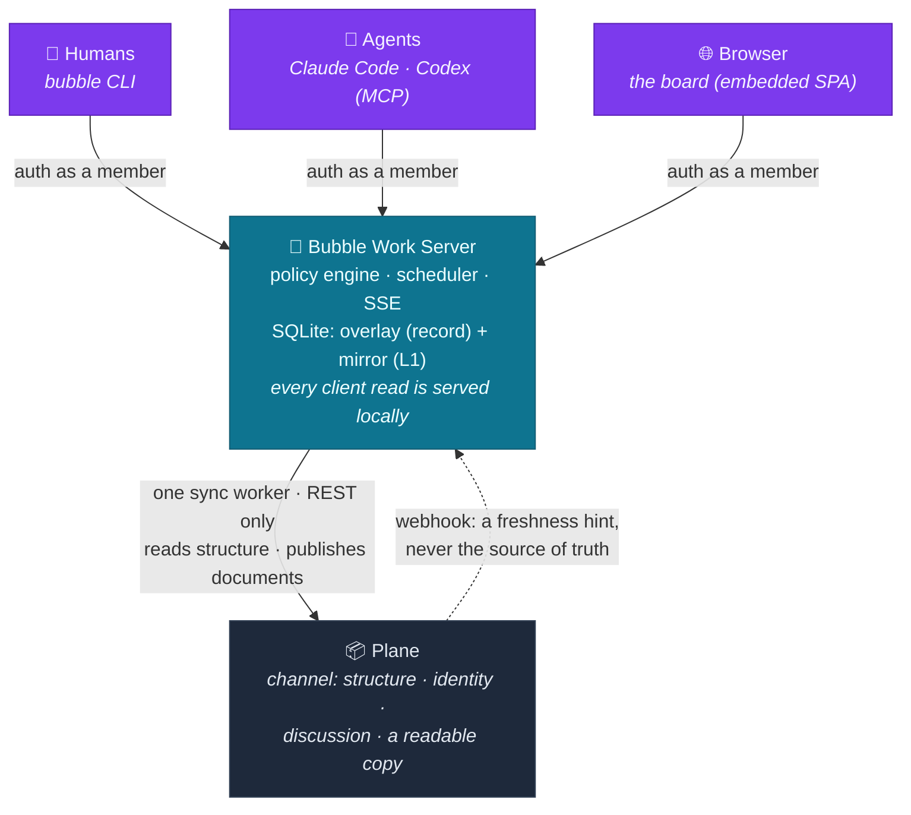
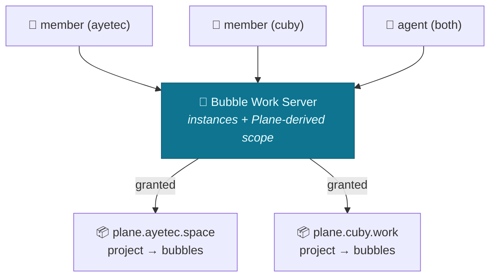

# Architecture — the Bubble Work server & clients

How the framework in the [README](../README.md) is actually built. This file is
the overview and the ownership rules; each module's details live in
[`modules/`](./modules), and the history of how each part got there lives in
[`journal/`](./journal).

The framework ships as **one Go binary in two modes**: a long-running **server**
that holds the authoritative state, serves its own web UI, and is the only thing
clients talk to — and a thin **client** (CLI for humans, MCP for agents). Clients
never touch Plane directly.

## 1. Topology

## 2. Source of truth — one owner per field

Every field has exactly one owner. That is what keeps the README's §8 "no
duplicated artifacts" rule mechanical rather than aspirational.

| State | Owner |
|-------|-------|
| Projects, modules, cycles, states | **Plane** |
| Who the members are, and what role each holds | **Plane** (§3) |
| Comments and activity | **Plane** |
| **Artifact bodies** — Brief, Logbook, revision write-ups | **Server** — Plane may still edit them; the edit is imported ([`modules/documents.md`](./modules/documents.md)) |
| **Pages** — a Workspace's reference material | **Server** ([`modules/pages.md`](./modules/pages.md)) |
| Heat, lifecycle level, Bubble contract, document observations | **Server** |
| The explicit `reviewed` stage, buoyancy tuning, notification prefs, read receipts | **Server** |
| Instance registry + credentials, kiosk tokens, the outbox | **Server** |

Plane is a **channel**: it carries the work's structure, its people, and its
discussion, and it receives a readable copy of every document. It is not where the
writing lives — but it is still somewhere writing can happen, and an edit made there
is imported rather than overwritten. The reasoning, and what that costs, is
[`decisions/0001`](./decisions/0001-plane-is-a-channel-not-the-record.md).

From a client's point of view the **server handles all state** — it is the single
interface and holds the record plus a materialized read-model of Plane (§6).

Two invariants follow from keying the overlay by Plane id:

- **An id Plane no longer has must not keep overlay rows.** Otherwise a deleted
  item leaks its progress timestamps forever, and — were an id ever reused — a new
  thread would inherit a stranger's history and be born warm. So the overlay is
  pruned against the live set, and only ever after a *complete* walk.
- **Except for what only we hold.** Documents and local pages are pruned on
  deliberate deletion, never as a side effect of an incomplete Plane walk, because
  for those rows there is no second copy to recover from.

## 3. Members & attribution — clients as team members

Identity is **Plane-native**, so it isn't duplicated. Everyone — human or agent —
authenticates with a **Plane API key**:

- **Humans use their own key.** The server verifies it via `/users/me`, then uses
  its **own** per-instance admin keys to find every instance whose member list
  contains that email — deriving the user's **instance scope** and **role**
  (`admin` when Plane role ≥ 20) directly from Plane. No account, token, or grant
  is created for a human.
- **Agents impersonate a human** by using that human's Plane key. The agent *is*
  that human for all purposes — same identity, scope, role, and (on the write
  path) Plane attribution. There is no separate agent registry.

The request resolves to an **Actor** (id, name, kind, admin, the instances it may
see), and every action is attributed to it. `GET /api/whoami` returns it. Details:
[`modules/identity.md`](./modules/identity.md).

> Trade-off of direct-key impersonation: an agent is indistinguishable from the
> human it acts as, so there is no agent-level audit trail, and revoking an agent
> means rotating that human's Plane key.

## 4. Policy engine — invariants, not suggestions

Because every mutation flows through the server, the framework's rules become
enforceable:

- **Creating a thread is production:** a thread needs a name, and creating one is the
  moment it earns its first heat
  ([`decisions/0002`](./decisions/0002-birth-is-production.md)). The shape of its
  document is the author's
  ([`decisions/0005`](./decisions/0005-the-framework-does-not-own-your-format.md)):
  what is missing is reported, never refused.
- **Heat = evidence:** only meaningful outputs register as heat; comments and
  cosmetic edits never warm a bubble.
- **Lifecycle:** Hot → Warm → Cooling → Dormant → Closed is computed centrally
  against the Cycle pulse, never stored and never decayed by a background job.
- **Structural integrity:** a write that duplicates a reserved heading (`## Brief`,
  `## Logbook`, `## Definition of Done`) is refused — a duplicate makes the region
  unreachable. It is the only shape rule the server enforces.

## 5. Three front doors, one API

Every capability is a **server method**. Each surface reuses that same method —
the CLI over HTTP, MCP by calling it directly, the browser over the same REST the
CLI uses — so the surfaces cannot drift apart, and the policy engine sits behind
all of them equally.

| Surface | Where | Detail |
|---|---|---|
| CLI (humans) | `bubble …` | [`modules/cli.md`](./modules/cli.md) |
| MCP (agents) | `/mcp`, **ours**, not Plane's | [`modules/mcp.md`](./modules/mcp.md) |
| Web (humans) | the embedded SPA at `/` | [`modules/web.md`](./modules/web.md) |
| Server admin | `bubble serve`, `bubble admin …` | [`operations.md`](./operations.md) |

> **Surface parity is the default.** A new capability lands on the REST API, the
> CLI and the MCP tools in the same change; the web follows when it has a visual
> form. Skip a surface only when the capability is inherently specific to one.

> The server is Plane's **only** client, and speaks to it over **REST only**. No
> client — human or agent — ever calls Plane directly or through Plane's MCP. This
> keeps the policy engine unbypassable: every path to Plane goes through the
> server's rules.

## 6. Storage & sync

**Storage:** SQLite — a single file, no external DB, keeps the server minimal and
easy to publish. It holds two things that must not be confused:

| | What it is | If you delete it |
|---|---|---|
| **Overlay** | server-owned truth per §2: **documents**, heat, progress, contracts, stage, instances, tuning, the outbox | real work is lost — this is the record |
| **Mirror (L1)** | a *projection* of Plane: projects, modules, work items, comments, cycles, states, members | nothing is lost; it costs a backfill (`bubble admin sync-rebuild`) |

That asymmetry is newer than the mirror and is the single most important thing to
know about backups: [`modules/storage.md`](./modules/storage.md).

**Reads never touch Plane.** Every client read is served locally. Plane allows 60
req/min per key, and a board that fetched live would exhaust a minute on one page
load.

**One reader.** A single sync worker is the only thing that reads Plane: a delta
pass on a short interval (`order_by=-updated_at`, early-stop at the watermark) and
a full reconcile hourly that also catches deletes and module membership. A partial
pass holds the watermark back rather than skipping what it missed — *"I could not
see it" must never be mistaken for "it is gone."*

**Writes are optimistic, through an outbox.** A write lands in SQLite and returns
immediately; the worker drains it to Plane with exponential backoff and abandons
after a bounded number of attempts. A field with an undrained entry is
**shielded**: an incoming sync will not overwrite it.

**Documents are published outward and imported back.** A body is authored here and
published to Plane; a body edited in Plane is imported and **wins**, with the version
it replaced kept as an undo. Which side wins when both moved is decided by the
outbox's field lock, not by a new rule — see
[`modules/plane-channel.md`](./modules/plane-channel.md). Bubble Work owns the
document's format and where it is authored, not the exclusive right to write it.

**Webhooks are a hint, not a source of truth.** Plane can push, and the server
accepts it, but the delta remains what guarantees correctness.

> **Being behind is fine; being behind silently is not.** A local read model
> introduces a failure the naive design did not have: if sync stops, the board
> keeps rendering, confidently, from data that is quietly getting older. Nothing
> errors. So the server reports its own staleness (`GET /api/status`) — an ageing
> mirror and the caller's unsent drafts both surface as a banner in the web UI and
> a warning line above `bubble ls`.

## 7. Federation — multiple Plane instances

The server can federate over several Plane deployments at once. Each is registered
as an **instance**: a named connection to a Plane workspace, with its API key
stored server-side. An instance either **pins one project** or, when no project is
set, **federates the whole workspace**.

Scope follows Plane membership; ids are namespaced `<slug>:<project>:<object>`;
one unreachable instance is logged and skipped rather than blanking the view.
Capabilities are per-instance too — what one Plane can hold, another cannot.
Details: [`modules/federation.md`](./modules/federation.md).

## 8. Tradeoff

This buys **enforceable invariants, centralized credentials, a shared multi-actor
view, and documents whose format we control** at the cost of **the server having
to run somewhere** (a small VPS, container, or home box) **and being the thing
that must be backed up**. SQLite + a single static binary keeps the first cost
about as low as a stateful server allows; the second is the price of owning the
writing, and is paid with the Plane copy plus `bubble admin export`.
