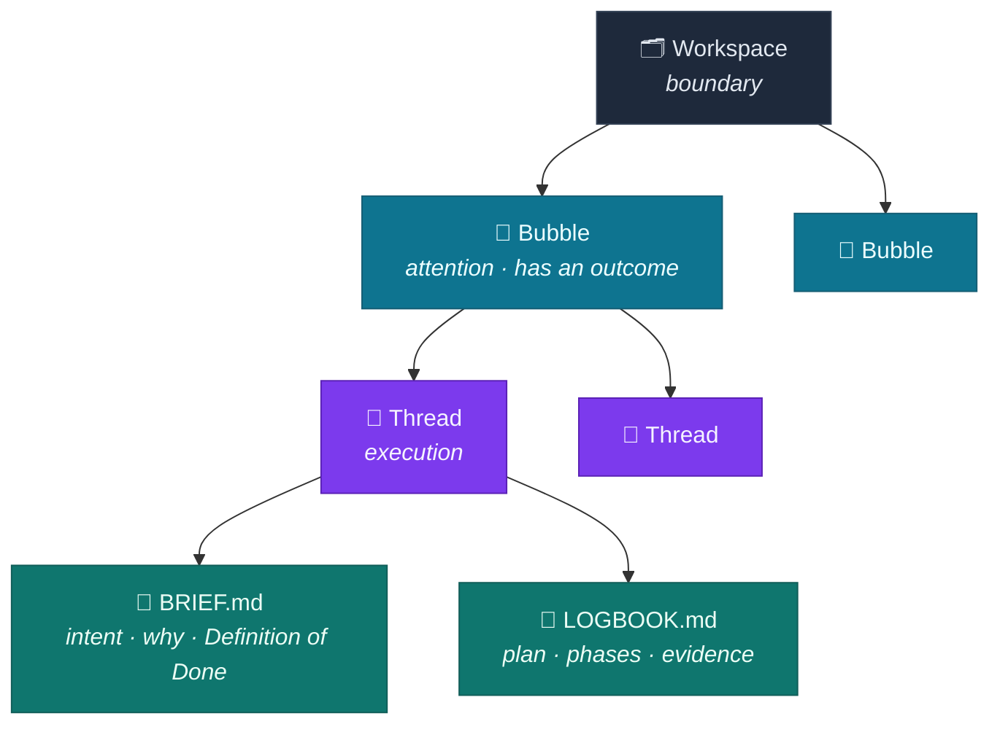
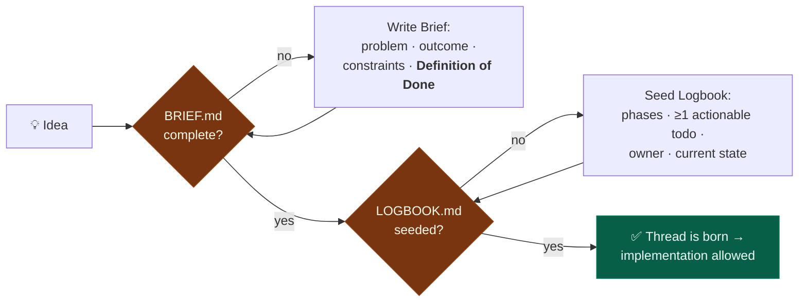
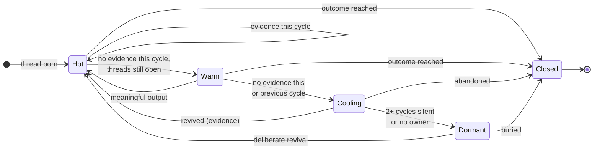
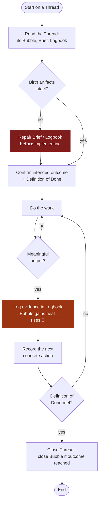
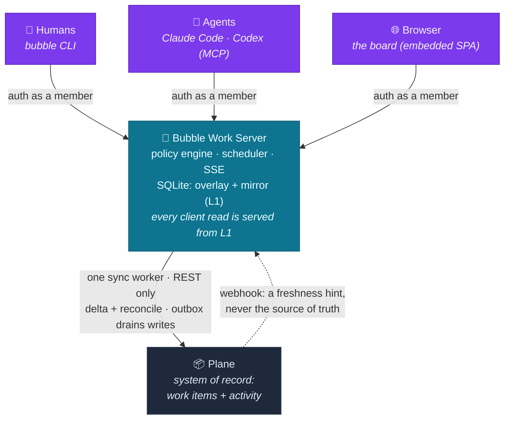
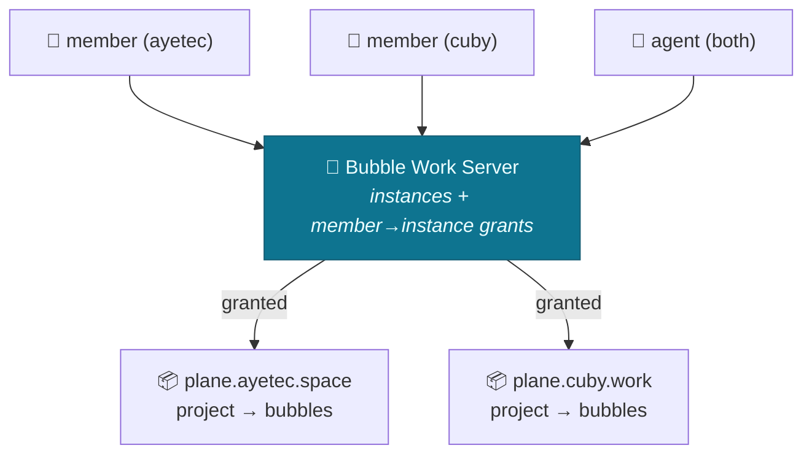

# Bubble Work — Core Spec

> A personal way-of-working where **attention behaves like buoyancy**.
> Work that produces evidence stays *hot* and *rises*; work that goes quiet *cools* and *sinks*.
> Time is the governing force. Your only standing job is to tend what floats at the top.

**One-line model:**
`Workspace = boundary · Bubble = attention · Cycle = pulse · Thread = execution · Artifacts = evidence`

---

## 0. The central metaphor: heat *is* buoyancy

Your original dump had bubbles rising and sinking. The physics that makes that literal is **temperature**: hot air rises, cold air sinks. So we don't have two metaphors — we have one.

| State | Temperature | Buoyancy | What it means |
|-------|-------------|----------|---------------|
| Fresh, producing evidence now | **Hot** | Rises to top | Work in progress, on your radar |
| Recent evidence, threads still open | **Warm** | Floats | Alive but slowing |
| No evidence this pulse or last | **Cooling** | Sinking | Being deferred |
| Silent for 2+ pulses / no owner | **Dormant** | At the bottom | Needs revival or burial |
| Outcome reached or abandoned | **Closed** | Removed | Done — stops taking attention |

A bubble rises **only** when reality changes (evidence), and sinks **automatically** as time passes without it. You never manually "keep something warm" — you either produce evidence or you let it sink honestly.

---

## 1. Vocabulary (and collision warnings)

The metaphor lives in the **human-facing layer**. Every term below has an explicit meaning so it never collides with tool terms or engineering terms.

| Term | Meaning in Bubble Work | ⚠️ Do not confuse with |
|------|------------------------|------------------------|
| **Workspace** | The boundary for a body of work (a project, or a temporal frame like a week/quarter) | A vendor "Workspace" (e.g. Plane's org-level container) |
| **Bubble** | A durable grouping of related threads — a unit of *attention* | A folder — a bubble has an outcome and can die |
| **Thread** | One executable unit of work inside a bubble | OS/CPU threads |
| **Cycle** | The repeating pulse against which heat is measured (the *heat window*) | A calendar month — it's a rhythm, not a date |
| **Heat** | Evidence of changed reality accumulated in the current cycle | Activity, comments, or motion |
| **Artifact** | The evidence a thread produces: Brief, Logbook, commits, deliverables | A generic file |
| **Page** | Reference material for a whole Workspace: a spec, a decision record | A thread's artifacts, which belong to *one* piece of work |

---

## 2. The model



### 2.1 Workspace — the boundary
The outermost container. It can be **abstract** (a project, a domain) or **temporal** (a day, week, month, quarter, year). A workspace holds bubbles and nothing else. It answers: *within which frame am I paying attention?*

### 2.2 Bubble — the unit of attention
A bubble groups related threads. The point of thinking of it as a *bubble* is that it **may go up or down as air or any force interacts with it** — and here that force is time acting on evidence. Unlike a folder, a bubble is a **living object with a contract** (§4). It rises and sinks on its own heat, and it can *die*. Your job as the operator is to keep an eye on what's floating at the top and decide, deliberately, whether to **revive**, **let sink**, or **close** what's below.

- **Rises automatically** when its threads produce evidence — publishing work slowly pushes the bubble up.
- **May be pushed up manually** when you consciously choose to re-prioritize a bubble.
- **Sinks automatically** as cycles pass without evidence — no action required; time defers it for you.

If a bubble has sunk but still matters, you **revive** it: refresh it with real work to push it back to the top.

### 2.3 Thread — the unit of execution
The core executable unit. A thread cannot enter implementation until it is **born** through its two birth artifacts (§3). This is the framework's most important constraint: *no vague idea becomes work without a Brief and a plan.*

### 2.4 Artifacts — the evidence
Threads produce artifacts. The two **birth artifacts** are native files; everything else (commits, PRs, published deliverables, recorded decisions) is *external evidence* the thread links to.

### 2.5 Pages — what outlives the work
A **Page** belongs to the Workspace, not to a bubble or a thread, and outlives
both. It is what remains true after the work that produced it has closed: a
product spec, a reference, an architecture decision.

The dividing line is ownership, and it is the same §8 rule about not duplicating
artifacts: anything about *one piece of work* — the plan, the progress, the
Definition of Done — belongs in that thread's Brief or Logbook. Anything the
whole Workspace has to stay consistent with belongs on a Page. A thread's Brief
says what to do; a Page says what has to remain true of it.

Writing a Page is **not evidence of production** (§5.1) — documenting what you
intend is not the same as changing reality, so pages earn no heat.

A Page maps to a Plane project page **where the instance can hold one**. Plane
Community serves pages only on its internal, session-authenticated API, so on
those deployments the server is the record instead, and says so on every surface.
That is a deliberate departure from §9.2's "Plane is the system of record", taken
because the alternative is not "Plane holds it" but "nobody does" — see
[`PAGES-CAPABILITY.md`](./PAGES-CAPABILITY.md).

---

## 3. Thread birth rule

> A thread must not enter implementation until **both** birth artifacts exist. Repairing a missing artifact comes *before* any implementation.



### 3.1 `BRIEF.md` — *why this exists*
Explains what the task is about: purpose, current state of the project, project-specific concepts to touch or refine, and any context that justifies doing it. **Mandatory section: Definition of Done.**

```markdown
# Brief: <thread name>
## Problem / opportunity
## Intended outcome
## Context & constraints
## Definition of Done      ← required
## Links to source material
```

### 3.2 `LOGBOOK.md` — *how it's going*
The living companion to the Brief. The task is **decomposed into phases**, each phase stating what must be done. Progress is published here as it happens. Folding in comp's tracker discipline, a seeded logbook carries **at least one actionable todo, a current owner, and a current state** (plus dependencies/blockers when they exist).

> **Small-thread escape hatch:** if the task is small enough, `LOGBOOK.md` may be omitted and the `BRIEF.md` closed with a short paragraph explaining how it was done.

**Single source of truth:** keep the Brief and plan in *one* place. Don't duplicate the same todos across a markdown file, a tracker tool, and code comments — pick the native layer (files) *or* the tool binding (§6), not both.

---

## 4. The Bubble contract (outcome semantics)

A bubble without an outcome is just a thematic folder that never dies. Every bubble declares three things up front:

| Field | Question it answers |
|-------|---------------------|
| **Intended outcome** | What reality looks like when this bubble is done |
| **Owner** | Who is accountable for it right now |
| **Closure condition** | The explicit signal that says "close this" |

When the closure condition is met — or when the outcome no longer justifies the work — the bubble is **closed**, not left to drift.

---

## 5. Heat & the bubble lifecycle

### 5.1 What generates heat (evidence of changed reality)
- A completed todo
- A committed or reviewed implementation
- A published deliverable
- A recorded decision
- Validated user / stakeholder feedback
- Removal of a material blocker

### 5.2 What does **not** generate heat
Comments, status pings, cosmetic edits, re-planning without output. Motion is not progress.

### 5.3 Lifecycle



> **Rule:** never create activity solely to keep a bubble warm. If a bubble keeps cooling, the honest move is to **revive it with real work, redefine it, or close it** — not to fake heat.

---

## 6. Way of work — the operating loop



**Before** — read the thread, identify its bubble/brief/logbook, repair any missing birth artifact, confirm the outcome and Definition of Done.
**During** — update the logbook when the plan materially changes; record blockers and decisions; link concrete evidence (commits, PRs, docs, builds, releases).
**After** — update completed/remaining todos, link produced artifacts, record the next concrete action, and change state only when it reflects reality.

---

## 7. Optional binding: agents & tools

The core above is **tool-agnostic and file-native** — it works with nothing but Markdown. When you want AI agents (Claude Code, Codex) or a tracker (Plane) to execute the same model, bind it *without duplicating* the artifacts.

### 7.1 Shared instruction source
Put the operating rules once in `AGENTS.md`; have `CLAUDE.md` import it so both agents share one source of truth.

```
your-repo/
├── AGENTS.md          # the rules in §1–§6
├── CLAUDE.md          # contains only:  @AGENTS.md
└── .codex/config.toml # optional MCP wiring
```

### 7.2 If you map onto Plane
Keep the metaphor human-facing; give each concept an explicit Plane object. Note Plane already owns the word *Workspace*, so your Workspace maps to a **Project**.

| Bubble Work | Plane object | Why |
|-------------|--------------|-----|
| Workspace | **Project** | Plane's own "Workspace" is the org container |
| Bubble | **Module** | Modules are durable logical groupings |
| Heat window | **Cycle** | Cycles are the time-boxed pulse |
| Thread | **Work item** | The executable unit |
| Brief | A region of the work-item **description** | Holds intent + Definition of Done |
| Logbook | The **same** description as the Brief, a different region | Phases + published evidence live beside the intent — one page, not a second tracker |
| Revision | **Sub-work-item** of the thread | A findings write-up or deliverable is its own object, but never its own thread |
| Page (§2.5) | **Project page**, or the server's overlay where Plane has no pages API | Belongs to the Workspace and outlives every thread in it |

> Interpretation: *the Bubble is the persistent body of work; Cycles are the pulses that keep it warm.* Don't keep one Cycle alive forever — each new Cycle is a fresh pulse against the same Bubble.

Introduce reusable agent skills (e.g. a `birth-thread` skill) **only after** you've run the process by hand enough to know which steps are actually stable.

---

## 8. Anti-patterns to design against

| Risk | Guardrail |
|------|-----------|
| **Activity gaming** — motion masquerading as progress | Heat requires *evidence of changed reality* (§5.1–5.2) |
| **Zombie bubbles** — nothing ever dies | Lifecycle has explicit Cooling → Dormant → Closed (§5.3) |
| **Thematic-folder bubbles** — no purpose | Every bubble carries outcome + owner + closure condition (§4) |
| **Duplicated artifacts** — same todos in 3 places | One source of truth: files *or* tool, not both (§3.2) |
| **Terminology collisions** — "Workspace", "Thread" | Explicit mappings; metaphor stays human-facing (§1) |
| **Ideas-straight-to-code** | Thread birth rule blocks implementation until Brief + Logbook exist (§3) |

---

## 9. Implementation — the Bubble Work server & clients

The framework ships as **one Go binary in two modes**: a long-running **server**
that holds the authoritative overlay state, serves its own web UI, and is the only
thing clients talk to — and a thin **client** (CLI for humans, MCP for agents)
that fetches and updates that state. Clients never touch Plane directly.

> This section describes the architecture. For **what is built today**, the
> README's Status section is the current answer, and each worksheet in `docs/`
> carries its own phase checklist.

### 9.1 Topology



### 9.2 Source of truth — one owner per field (Model A)

The server is authoritative for the Bubble Work *overlay*; Plane stays authoritative for the *work itself*. This keeps the §8 "no duplicated artifacts" rule intact: every field has exactly one owner.

| State | Owner |
|-------|-------|
| Work items and their bodies, comments, projects, modules, cycles, states, pages | **Plane** |
| Who the members are, and what role each holds | **Plane** (§9.3) |
| Heat, lifecycle state, Bubble contract (outcome/owner/closure), birth-rule status | **Server** |
| The explicit `reviewed` stage, buoyancy tuning, notification prefs, read receipts | **Server** |
| Instance registry + credentials, kiosk tokens, the outbox | **Server** |

From a client's point of view the **server handles all state** — it is the single
interface and holds the authoritative overlay plus a materialized read-model of
Plane (§9.6). Behind the server, Plane remains the durable book of record.

The overlay is keyed by Plane id, which makes one invariant load-bearing: **an id
Plane no longer has must not keep overlay rows.** Otherwise a deleted item leaks
its progress timestamps forever, and — were an id ever reused — a new thread
would inherit a stranger's history and be born warm. So the overlay is pruned
against the live set, and only ever after a *complete* walk.

### 9.3 Members & attribution — clients as team members
Identity is **Plane-native**, so it isn't duplicated (§8). Everyone — human or
agent — authenticates with a **Plane API key**:

- **Humans use their own key.** The server verifies it via `/users/me`, then uses
  its **own** per-instance admin keys to find every instance whose member list
  contains that email — deriving the user's **instance scope** and **role**
  (`admin` when Plane role ≥ 20) directly from Plane. No account, token, or grant
  is created for a human.
- **Agents impersonate a human** by using that human's Plane key. The agent *is*
  that human for all purposes — same identity, scope, role, and (on the write
  path) Plane attribution. There is no separate agent registry.

The request resolves to an **Actor** (id, name, kind, admin, the instances it may
see), and every action is attributed to it. Resolved identities are cached
briefly to avoid calling Plane on every request. `GET /api/whoami` returns the
resolved Actor.

> Trade-off of direct-key impersonation: an agent is indistinguishable from the
> human it acts as, so there is no agent-level audit trail, and revoking an agent
> means rotating that human's Plane key.

### 9.4 Policy engine — invariants, not suggestions
Because every mutation flows through the server, the framework's rules become enforceable:
- **Birth rule (§3):** the server rejects any attempt to move a thread into implementation until a Brief and a seeded Logbook exist.
- **Heat = evidence (§5):** only meaningful outputs register as heat; comments and cosmetic edits never warm a bubble.
- **Lifecycle (§5.3):** transitions Hot → Warm → Cooling → Dormant → Closed are computed centrally against the Cycle pulse.

### 9.5 Three front doors, one API

Every capability is a **server method**. Each surface reuses that same method —
the CLI over HTTP, MCP by calling it directly, the browser over the same REST the
CLI uses — so the surfaces cannot drift apart, and the policy engine (§9.4) sits
behind all of them equally.

- **CLI (humans):** `bubble ls` (buoyancy view), `bubble heat <id>`, `bubble show`
  / `bubble thread` (a bubble's timeline, a thread's interior), `bubble birth`,
  `bubble logbook` / `dod` / `section` / `todo` / `revision`, `bubble comment`,
  `bubble move`, `bubble workspace|bubble|page`, `bubble delete`,
  `bubble notifications`, `bubble whoami`, `bubble use`, `bubble init`.
- **MCP (agents):** the same operations as tools — `list_workspaces`,
  `list_bubbles`, `read_thread`, `thread_timeline`, `birth_thread`,
  `update_thread`, `toggle_todo`, `add_revision`, `set_contract`, `close_bubble`,
  `move_thread`, the page tools and the guarded deletes — so Claude Code / Codex
  are first-class members. Agents consume the Bubble Work server's **own** MCP
  interface at `/mcp`, **not** Plane's MCP.
- **Web (humans):** the server embeds and serves its own SPA at `/` — the
  buoyancy board, thread interiors with the artifacts editable in place, and an
  admin surface. One binary, one origin.
- **Server admin:** `bubble serve` runs the brain; holds the Plane URLs + keys;
  runs the sync worker (§9.6) and the scheduler for cooling transitions and
  notifications. `bubble admin …` inspects and tunes it.

> **Surface parity is the default.** A new capability lands on the REST API, the
> CLI and the MCP tools in the same change; the web follows when it has a visual
> form. Skip a surface only when the capability is inherently specific to one.

> The server is Plane's **only** client, and speaks to it over **REST only**. No
> client — human or agent — ever calls Plane directly or through Plane's MCP.
> This keeps the policy engine (§9.4) unbypassable: every path to Plane goes
> through the server's rules.

### 9.6 Storage & sync — SQLite as L1, one worker as the only reader

**Storage:** SQLite — a single file, no external DB, keeps the server minimal and
easy to publish. It holds two things that must not be confused:

| | What it is | If you delete it |
|---|---|---|
| **Overlay** | server-owned truth per §9.2: heat, progress, contracts, stage, instances, members, tuning, the outbox | the work survives, the Bubble Work layer is lost |
| **Mirror (L1)** | a *projection* of Plane: projects, modules, work items and their bodies, comments, cycles, states, members | nothing is lost; it costs a backfill (`bubble admin sync-rebuild`) |

**Reads never touch Plane.** Every client read is served from the mirror. This is
the binding constraint made tractable: Plane allows 60 req/min per key, and a
board that fetched live would exhaust a minute on a single page load.

**One reader.** A single sync worker is the only thing that reads Plane: a delta
pass on a short interval (`order_by=-updated_at`, early-stop at the watermark),
and a full reconcile hourly that also catches deletes and module membership. A
partial pass holds the watermark back rather than skipping what it missed —
*"I could not see it" must never be mistaken for "it is gone."* A rate budget
parses Plane's own `X-RateLimit-*` headers, waits until reset instead of guessing,
and reserves a lane so background sync can never starve a human request.

**Writes are optimistic, through an outbox.** A write lands in SQLite and returns
immediately; the worker drains it to Plane with exponential backoff and abandons
after a bounded number of attempts. A field with an undrained entry is
**shielded**: an incoming sync will not overwrite it. When the entry drains or is
abandoned, Plane is truth again — which is §9.2's conflict policy, held
mechanically rather than by convention.

**Webhooks are a hint, not a source of truth.** Plane can push, and the server
accepts it, but the delta remains what guarantees correctness — an event only
makes the mirror fresher, sooner.

> **Being behind is fine; being behind silently is not.** A local read model
> introduces a failure the naive design did not have: if sync stops, the board
> keeps rendering, confidently, from data that is quietly getting older. Nothing
> errors. So the server reports its own staleness (`GET /api/status`) — an ageing
> mirror and the caller's unsent drafts both surface as a banner in the web UI
> and a warning line above `bubble ls`.

The full worksheet, including what was measured against a live instance, is
[`PLANE-SYNC.md`](./PLANE-SYNC.md).

### 9.7 Federation — multiple Plane instances

The server can federate over several Plane deployments at once (e.g.
`plane.ayetec.space` and `plane.cuby.work`). Each is registered as an
**instance**: a named connection to a Plane workspace, with its API key stored
server-side (§9.2). An instance either **pins one project** or, when no project
is set, **federates the whole workspace** (auto-discovering every project in
it).



- **Scope follows Plane membership.** A caller sees only the instances whose
  Plane workspace lists their email — the isolation boundary between separate
  orgs. A `cuby` member never sees `ayetec` bubbles.
- **Bubble ids are namespaced** `<instance-slug>:<project-id>:<module-id>`, so
  they stay unique and routable (heat/close resolve the right instance and
  project automatically).
- **`collect()` fans out** over the caller's authorized instances; one
  unreachable instance is logged and skipped, never blanking the whole view.
- **Ownership (extends §9.2):** the instance registry is server-owned overlay
  state; API keys never leave the server or appear in `instance list`.

Admin (on the server host): `bubble instance add|list|remove`. Membership and
roles are read from Plane, not managed here.

### 9.8 Tradeoff
This buys **enforceable invariants, centralized credentials, and a shared multi-actor view** at the cost of **the server having to run somewhere** (a small VPS, container, or home box). SQLite + a single static binary keeps that cost about as low as a stateful server allows.

---

*This is the canonical Bubble Work spec — it unifies the original idea dump (buoyancy, BRIEF.md + LOGBOOK.md, time-governed rise/fall) with the rigor added in review: evidence-based heat, an explicit death mechanism, outcome semantics, the Cycle pulse, and — in §9 — a server/client implementation where humans and agents are peer members of the organization. It supersedes and replaces the earlier dump.*
